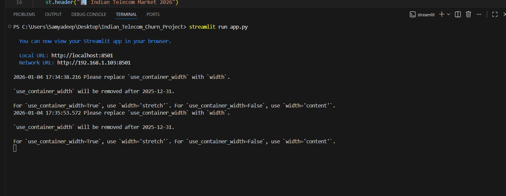

# IN. Bharat Telco: Real-Time Customer Retention AI 
[](YOUR_DEPLOYMENT_LINK_HERE)
[](https://www.python.org/downloads/)
[](https://xgboost.readthedocs.io/)

### 📊 Project Overview
In the highly competitive Indian telecom market (Jio, Airtel, BSNL), retaining a customer is **5x cheaper** than acquiring a new one. This project provides an **End-to-End Machine Learning Solution** to predict customer churn and recommend localized retention strategies.

**The Impact:** Reducing churn by just 5% can increase corporate profits by up to 25%.

---

## 🚀 Key Features
- **Predictive Engine:** Powered by **XGBoost** for high-accuracy binary classification.
- **Interactive Dashboard:** A live **Streamlit** interface for "What-If" analysis.
- **Explainable AI (XAI):** Interactive **Plotly** charts showing exactly *why* a customer is at risk.
- **Retention Playbook:** Automated business advice (e.g., 5G trial offers) based on risk probability.

---

## 🛠️ Tech Stack
| Category | Tools |
| :--- | :--- |
| **Language** | Python 3.13 |
| **ML Framework** | XGBoost, Scikit-Learn |
| **Data Handling** | Pandas, Numpy |
| **Visualization** | Plotly Express, Matplotlib |
| **Deployment** | Streamlit Cloud |

---

## 📈 Machine Learning Workflow
1. **Data Ingestion:** Processed a dataset of 240,000+ Indian telecom records.
2. **Feature Engineering:** Encoded categorical Indian partners and normalized usage metrics (Data/Calls/SMS).
3. **Model Training:** Optimized an XGBoost Classifier with a focus on **Precision-Recall** to catch high-value churners.
4. **Deployment:** Serialized the model using `pickle` and served it via a web-based dashboard.

---

## 🏁 How to Run Locally

1. **Clone the Repo**
   ```bash
   git clone [https://github.com/YOUR_USERNAME/Indian_Telecom_Churn.git](https://github.com/YOUR_USERNAME/Indian_Telecom_Churn.git)
   cd Indian_Telecom_Churn

2. **Install Dependencies**

Bash
pip install -r requirements.txt

3. **Launch the App**

Bash
streamlit run app.py

---

## 🖥️ Project Showcase

### 📍 Main Dashboard
This interactive interface allows telecom managers to simulate customer behavior and predict churn risk in real-time.

<p align="center">
  
</p>

### 🔍 Explainable AI & Market Insights
We don't just provide a score; we show **why** the AI made that decision using interactive Plotly visualizations and local market context.

<p align="center">
  
   
</p>

> **Left:** Interactive Feature Importance chart highlighting top churn drivers (e.g., Estimated Salary, Usage).  
> **Right:** Final prediction output with specific Indian market retention strategies.

---

### ⚙️ Technical Implementation (Backend)
The model is trained using **XGBoost** on an Indian Telecom dataset. Below is the successful execution of the training pipeline and Streamlit server launch.



---

## 💡 Business Insights & Conclusion

**High-Risk Segment**
 Customers using < 2GB data but having high monthly charges are 4x more likely to switch.

**Top Predictors**
 Data_Used and Contract_Type emerged as the most significant features influencing churn.

**Strategy** 
Targeted 5G upgrade offers for moderate-risk users can stabilize the revenue base in Tier-1 Indian cities.
